# 왔어 (Watseo)

> **상세 위치 없이, 도착 상태만 함께 확인하는 귀가 확인 앱**

**왔어**는 귀가 중인 사용자가 도착 장소에 도착했는지 QR로 확인하고, 연결된 사람이 필요한 상태를 확인할 수 있도록 돕는 모바일 앱입니다.

이동 경로나 실시간 위치를 계속 공유하지 않고, **도착 확인 상태와 필요한 알림만** 전달하는 것을 목표로 합니다.

---

## 📱 스크린샷 / UI 미리보기

### 핵심 화면

<p align="center">
  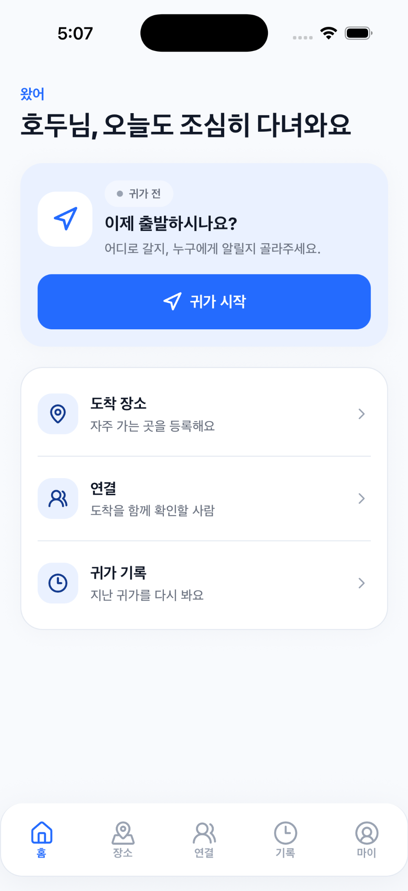
  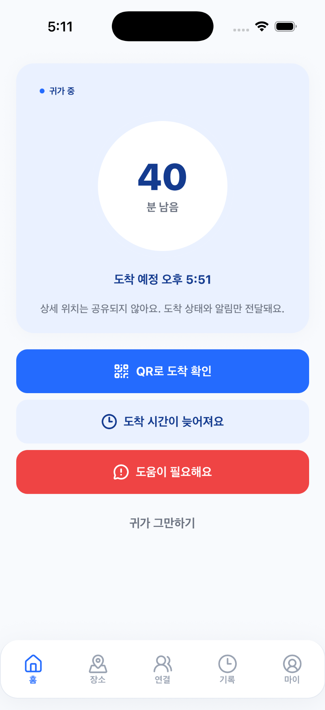
  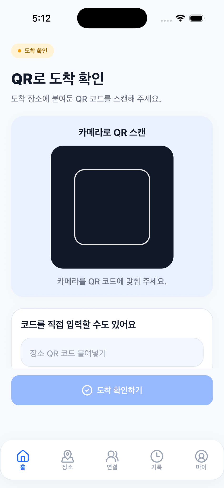
</p>

### 사용 흐름

#### 1. 앱 시작과 초기 안내

<p align="center">
  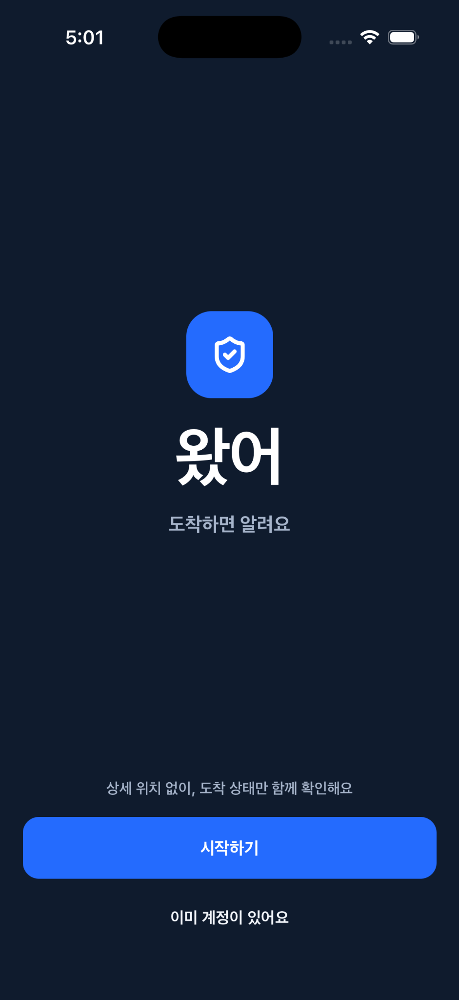
  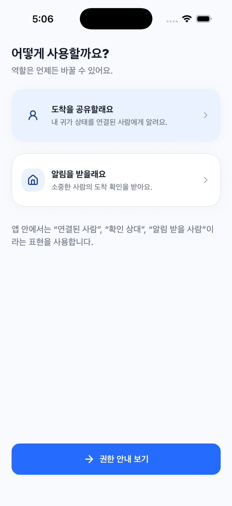
  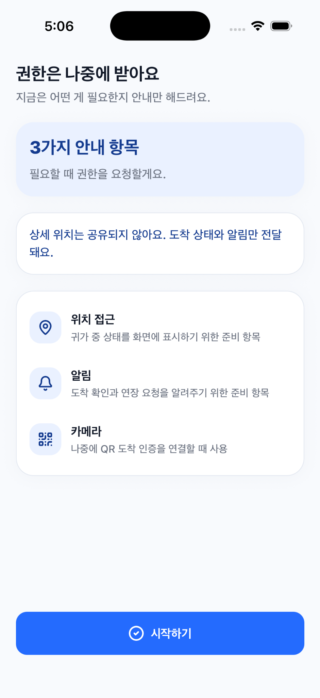
</p>

#### 2. 연결된 사람 추가

<p align="center">
  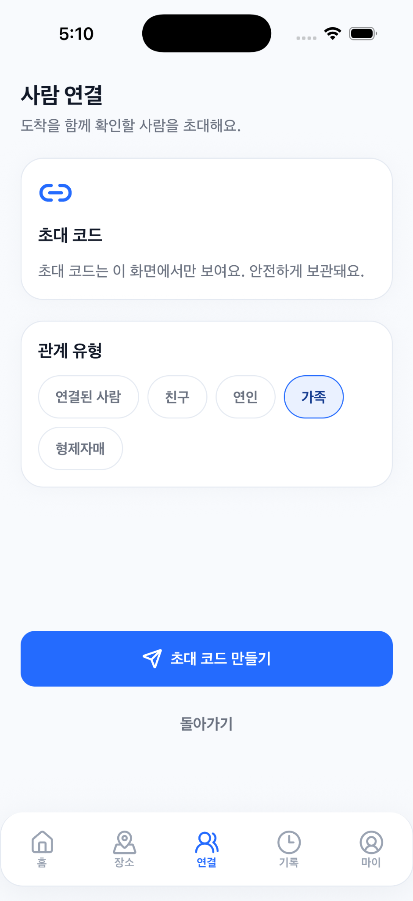
  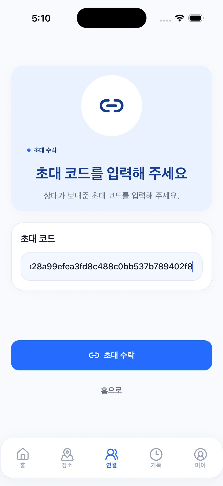
</p>

#### 3. 귀가 시작부터 도착 확인까지

<p align="center">
  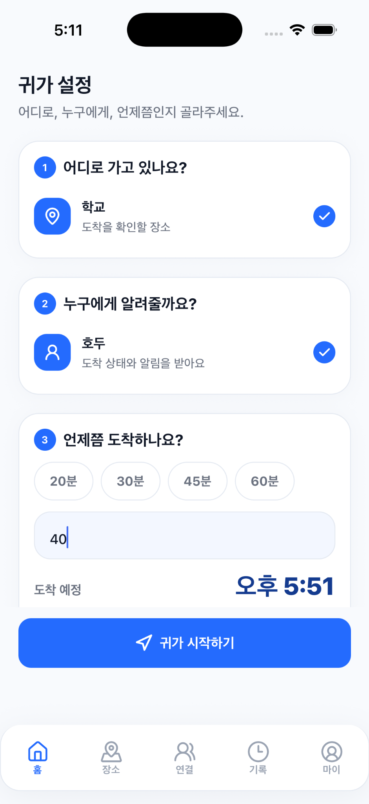
  
  
</p>

#### 4. 장소와 기록 관리

<p align="center">
  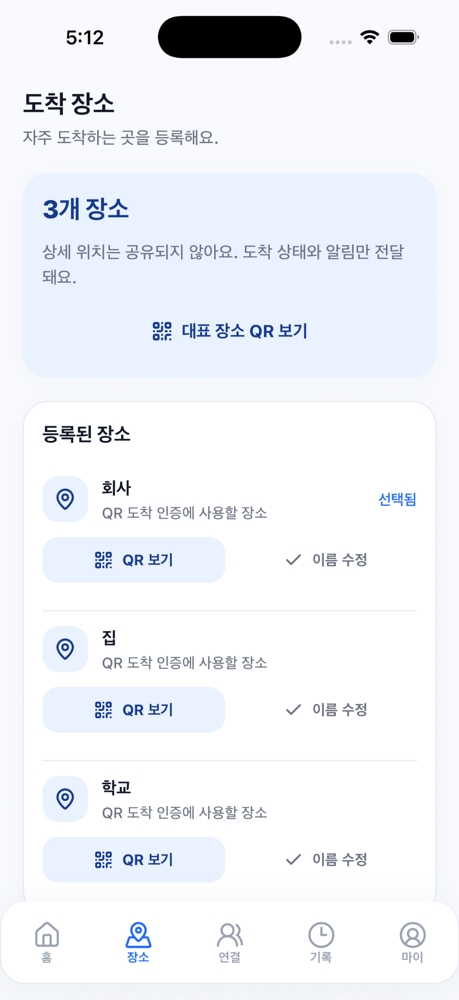
  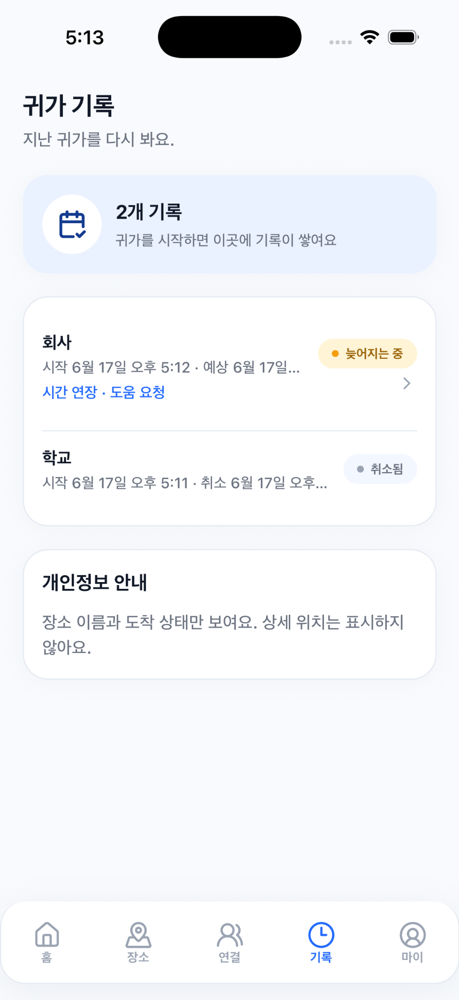
</p>

---

## 🚶 앱 사용 흐름

### 1. 회원가입 / 로그인
- 이메일 기반으로 계정을 만들고 로그인합니다.

### 2. 닉네임 설정
- 연결된 사람에게 표시될 닉네임을 설정합니다.

### 3. 연결된 사람 추가
- **A**가 초대 코드를 생성합니다.
- **B**가 그 초대 코드를 입력합니다.
- 서로 연결이 완료되면, 도착 상태를 함께 확인할 수 있습니다.

### 4. 도착 장소 등록
- 집, 학교, 회사 등 자주 가는 장소를 등록합니다.
- 각 장소별로 전용 **QR 코드**를 확인할 수 있습니다. (장소에 붙여두는 용도)

### 5. 귀가 시작
- 도착 장소를 선택합니다.
- 상태를 공유할 **연결된 사람**을 선택합니다.
- 예상 도착 시간을 선택합니다.

### 6. 귀가 중
- 내 귀가 상황을 확인합니다.
- 도착이 늦어질 것 같으면 **시간 연장 요청**을 보냅니다.
- 도움이 필요하면 **도움 요청**을 보냅니다.

### 7. 도착 확인
- 장소에 붙여둔 **QR 코드를 스캔**합니다.
- 도착 상태가 기록되고, 연결된 사람에게 도착 확인이 전달됩니다.
- 카메라 사용이 어려운 경우 **수동 QR 입력**으로 대체할 수 있습니다.

### 8. 기록 확인
- 지난 귀가 기록을 확인합니다.
- `취소됨` / `QR 도착 확인 완료` / `도움 요청` / `시간 연장` 등 상태를 확인할 수 있습니다.

---

## ✨ 주요 기능

| 기능 | 설명 |
| --- | --- |
| 🔐 계정 / 온보딩 | 로그인, 닉네임 설정, 초기 안내 흐름 |
| 🔗 연결 초대 | 초대 코드 생성 / 입력으로 연결된 사람 추가 |
| 📍 도착 장소 관리 | 자주 가는 장소 등록 및 관리 |
| 🔳 장소별 QR 코드 | 장소마다 고유 QR 코드 발급 |
| 🏠 귀가 시작 | 장소·연결된 사람·예상 도착 시간 선택 후 시작 |
| ⏳ 진행 중 귀가 상태 | 현재 귀가 상황을 한눈에 확인 |
| ➕ 시간 연장 요청 | 도착이 늦어질 때 상태를 부드럽게 갱신 |
| 🆘 도움 요청 | 도움이 필요할 때 연결된 사람에게 요청 전달 |
| ✅ QR 도착 확인 | 등록한 장소의 QR 스캔으로 도착 확인 |
| 📜 귀가 기록 | 지난 귀가 내역과 상태 확인 |
| 🙂 Friendly error handling | 오류 상황을 부드럽고 안심되는 메시지로 안내 |
| 👤 마이 탭 | 내 프로필과 계정 정보 확인 |

---

## 🔒 개인정보 원칙

왔어는 **안심**을 위한 앱입니다.

- 상세 위치는 계속 공유되지 않습니다.
- 이동 경로를 저장하거나 보여주지 않습니다.
- 연결된 사람에게는 **도착 상태와 필요한 알림만** 전달됩니다.
- QR 도착 확인은 사용자가 직접 **등록한 장소를 기준**으로 이루어집니다.
- 현재 MVP는 실시간 위치 공유 기능을 포함하지 않습니다.

> “상세 위치는 계속 공유되지 않고, 도착 인증 상태와 필요한 알림만 전달돼요.”

---

## 🧱 기술 스택

| 분류 | 사용 기술 |
| --- | --- |
| 앱 프레임워크 | Expo / React Native |
| 언어 | TypeScript |
| 라우팅 | Expo Router (파일 기반 라우팅) |
| 인증 | Supabase Auth |
| 데이터베이스 | Supabase Postgres |
| 접근 제어 | Supabase RLS (Row Level Security) |
| 서버 로직 | Supabase RPC |
| 카메라 / QR 스캔 | expo-camera |
| QR 코드 생성 | react-native-qrcode-svg |
| 빌드 방식 | Expo Development Build (dev client) |

> 📌 **푸시 알림은 이번 MVP 범위에서 제외**되어 있으며, 아래 [TODO](#-현재-mvp-범위)에 정리되어 있습니다.

---

## 🗂 프로젝트 구조

```
watseo-app/
├── app/                      # Expo Router 화면 (파일 기반 라우팅)
│   ├── (onboarding)/         # 온보딩 · 로그인 · 역할 · 권한 안내
│   └── (tabs)/               # 메인 탭
│       ├── home/             # 귀가 시작 · 진행 중 · 도착 확인 · 연장 · 도움 요청
│       ├── places/           # 도착 장소 · 장소별 QR 코드
│       ├── connections/      # 연결된 사람 · 초대 · 연결
│       ├── history/          # 귀가 기록
│       └── my/               # 마이 탭
├── src/
│   ├── components/           # 재사용 UI 컴포넌트 (카드, 버튼, 상태 칩 등)
│   ├── features/             # 도메인별 로직 (auth, trips, connections, destinations, arrival, history, profile)
│   ├── lib/                  # Supabase 클라이언트, friendly alert 등 공용 유틸
│   ├── theme/                # 디자인 토큰 (tokens.ts)
│   ├── data/                 # 목업 데이터 (mock.ts)
│   └── types/                # 타입 정의
├── supabase/
│   └── migrations/           # DB 스키마 마이그레이션
├── docs/                     # 프로젝트 문서 (개발 로그, QA·릴리스 체크리스트 등)
└── assets/                   # 아이콘 · 스플래시 이미지
```

---

## ▶️ 실행 방법

이 앱은 `expo-camera` 등 네이티브 모듈을 사용하므로 **Development Build(dev client)** 로 실행합니다. (Expo Go에서는 일부 기능이 동작하지 않습니다.)

### 1. 의존성 설치 & 환경 변수 설정

```bash
npm install
cp .env.example .env
# .env 파일을 열어 Supabase URL / anon key를 채워주세요
```

### 2. iOS 개발 빌드 실행 (시뮬레이터)

```bash
npx expo run:ios
npx expo start --dev-client -c
```

### 3. 실기기 테스트

```bash
npx expo run:ios --device
npx expo start --dev-client --tunnel -c
```

### 4. 타입 체크

```bash
npm run typecheck
```

---

## ⚙️ Supabase 설정

`.env` 파일에 아래 환경 변수를 설정합니다. **실제 키 값은 저장소에 포함하지 마세요.**

```env
EXPO_PUBLIC_SUPABASE_URL=
EXPO_PUBLIC_SUPABASE_ANON_KEY=
```

⚠️ **주의사항**
- `service role key`는 클라이언트(앱)에 절대 포함하지 않습니다.
- `.env` 파일은 Git에 올리지 않습니다. (`.gitignore`에 이미 포함되어 있습니다.)
- 클라이언트에는 공개 가능한 `anon key`만 사용합니다.

DB 스키마는 `supabase/migrations/` 에서 확인할 수 있습니다.

---

## 📦 현재 MVP 범위

### ✅ 포함된 것
- [x] QR 도착 확인
- [x] 수동 QR 입력 fallback
- [x] 연결 초대 (초대 코드 생성 / 입력)
- [x] 시간 연장 요청
- [x] 도움 요청
- [x] 귀가 기록
- [x] 마이 탭
- [x] Friendly error handling

### 🚧 제외 / 다음 업데이트
- [ ] 실제 푸시 알림
- [ ] 앱스토어 / 플레이스토어 정식 배포
- [ ] UI/UX 추가 개선
- [ ] Android 실기기 테스트
- [ ] TestFlight / Play Console 내부 테스트

---

## 📄 라이선스

이 프로젝트의 라이선스는 [LICENSE](./LICENSE) 파일을 참고해주세요.
